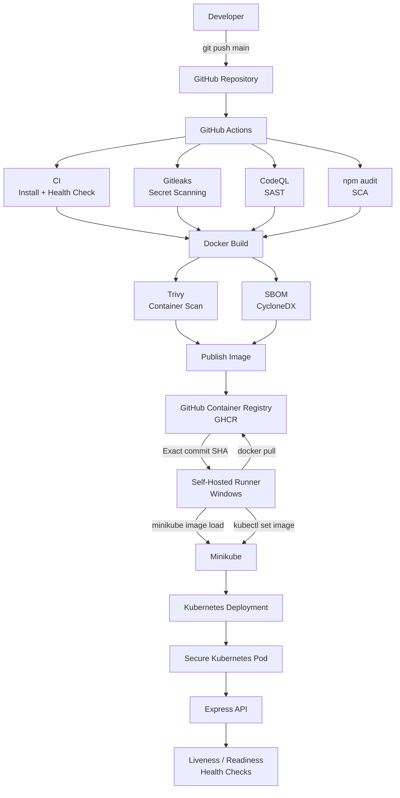

# Secure Kubernetes DevSecOps Pipeline

A security-focused CI/CD pipeline for containerized applications, built with **GitHub Actions, Docker, Kubernetes, Minikube, and GitHub Container Registry (GHCR)**.

The project demonstrates how security controls can be integrated throughout the software delivery lifecycle — from source-code analysis and dependency scanning to container security, SBOM generation, image publishing, and automated Kubernetes deployment.

## Project Overview

The application is a small Node.js/Express API deployed to Kubernetes.

Every push to the `main` branch triggers an automated pipeline that:

1. Runs application CI and health checks
2. Scans the source code with CodeQL
3. Scans dependencies with `npm audit`
4. Builds a Docker image
5. Scans the container image with Trivy
6. Generates a Software Bill of Materials (SBOM)
7. Publishes the image to GitHub Container Registry
8. Deploys the exact image version to a local Minikube cluster
9. Verifies the Kubernetes rollout and application health

## Technology Stack

* **Application:** Node.js / Express
* **Containerization:** Docker
* **Orchestration:** Kubernetes
* **Local Kubernetes:** Minikube
* **CI/CD:** GitHub Actions
* **Container Registry:** GitHub Container Registry (GHCR)
* **SAST:** CodeQL
* **Secret Scanning:** Gitleaks
* **SCA:** npm audit
* **Container Security:** Trivy
* **SBOM:** CycloneDX
* **Deployment Runner:** GitHub Actions self-hosted runner on Windows

## Repository Structure

```text
.
├── .github/
│   └── workflows/
│       └── security-pipeline.yml
│
├── k8s/
│   ├── configmap.yaml
│   ├── deployment.yaml
│   ├── rbac.yaml
│   ├── secret.yaml
│   └── service.yaml
│
├── src/
│   └── server.js
│
├── .dockerignore
├── .gitignore
├── Dockerfile
├── package.json
├── package-lock.json
└── README.md
```

## CI/CD Pipeline

## Architecture




The pipeline follows a security-focused workflow:

```text
Git Push
   ↓
CI + Health Check
   ↓
Gitleaks ── CodeQL ── npm audit
   ↓
Docker Build
   ↓
Trivy + SBOM
   ↓
Publish Image to GHCR
   ↓
Self-Hosted Runner
   ↓
Deploy to Minikube
   ↓
Kubernetes Rollout
   ↓
Application Health Check
```

## Kubernetes Security

The Kubernetes deployment applies multiple container and workload security controls, including:

* Non-root container execution
* Read-only root filesystem
* All Linux capabilities dropped
* Privilege escalation disabled
* Seccomp `RuntimeDefault`
* CPU and memory resource limits
* Kubernetes Secrets and ConfigMaps
* Least-privilege RBAC
* Liveness and readiness probes
* Service account isolation

## Image Versioning

Container images are tagged using the Git commit SHA.

For example:

```text
ghcr.io/yassinmedhatt/kubernetes-devsecops-project:<commit-sha>
```

This allows each deployment to reference an exact, immutable version of the application rather than relying on a mutable tag such as `latest`.

## Deployment

The project uses a **self-hosted GitHub Actions runner** running on the local Windows development machine.

After the image is published to GHCR, the runner:

1. Pulls the exact image associated with the triggering commit
2. Loads the image into Minikube
3. Updates the existing Kubernetes Deployment using `kubectl set image`
4. Waits for the Kubernetes rollout to complete
5. Performs an application health check

This allows the CI/CD pipeline to automatically deploy new application versions to the local Kubernetes environment.

## Project Status

The core DevSecOps pipeline is fully operational from source-code push through automated Kubernetes deployment.

Future improvements may include making additional security scanners blocking gates and expanding Kubernetes security validation.

---

**Author:** Yassin Medhat
