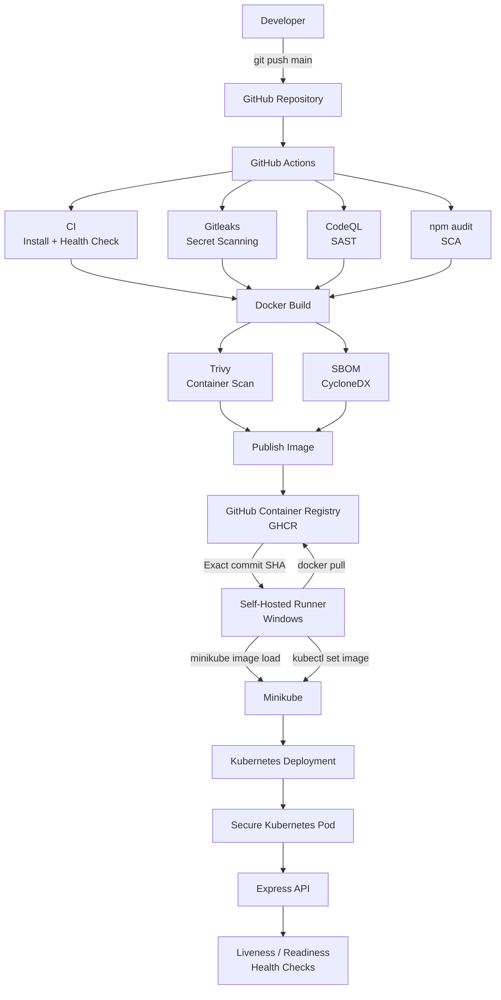

# Secure Kubernetes DevSecOps Pipeline

A security-focused CI/CD pipeline for containerized applications, built with **GitHub Actions, Docker, Kubernetes, Minikube, and GitHub Container Registry (GHCR)**.

The project demonstrates how security controls can be integrated throughout the software delivery lifecycle — from source-code analysis and dependency scanning to container security, SBOM generation, image publishing, and automated Kubernetes deployment.

## Project Overview

The application is a small Node.js/Express API deployed to Kubernetes.

Every push to the `main` branch triggers an automated pipeline that:

1. Runs application CI and health checks
2. Scans the source code with CodeQL
3. Scans dependencies with `npm audit`
4. Builds a Docker image
5. Scans the container image with Trivy
6. Generates a Software Bill of Materials (SBOM)
7. Publishes the image to GitHub Container Registry
8. Deploys the exact image version to a local Minikube cluster
9. Verifies the Kubernetes rollout and application health

## Technology Stack

* **Application:** Node.js / Express
* **Containerization:** Docker
* **Orchestration:** Kubernetes
* **Local Kubernetes:** Minikube
* **CI/CD:** GitHub Actions
* **Container Registry:** GitHub Container Registry (GHCR)
* **SAST:** CodeQL
* **Secret Scanning:** Gitleaks
* **SCA:** npm audit
* **Container Security:** Trivy
* **SBOM:** CycloneDX
* **Deployment Runner:** GitHub Actions self-hosted runner on Windows

## Repository Structure

```text
.
├── .github/
│   └── workflows/
│       └── security-pipeline.yaml
│
├── k8s/
│   ├── configmap.yaml
│   ├── deployment.yaml
│   ├── rbac.yaml
│   ├── secret.yaml
│   └── service.yaml
│
├── src/
│   └── server.js
│
├── docs/
│   └── images/
│       ├── github-actions-pipeline.png
│       └── kubernetes-deployment.png
│
├── .dockerignore
├── .gitignore
├── Dockerfile
├── package.json
├── package-lock.json
└── README.md
```

## Architecture



## GitHub Actions Pipeline

The complete CI/CD pipeline runs automatically after changes are pushed to the `main` branch.


The pipeline performs source-code checks, dependency scanning, container security scanning, SBOM generation, image publishing to GHCR, and automated deployment to Minikube.

The pipeline follows this workflow:

```text
Git Push
   ↓
CI + Health Check
   ↓
Gitleaks ── CodeQL ── npm audit
   ↓
Docker Build
   ↓
Trivy + SBOM
   ↓
Publish Image to GHCR
   ↓
Self-Hosted Runner
   ↓
Deploy to Minikube
   ↓
Kubernetes Rollout
   ↓
Application Health Check
```

## Security Controls

Security is applied at multiple stages of the software delivery and deployment lifecycle.

### Source & Dependency Security

| Control       | Purpose                                                           | Implementation                           |
| ------------- | ----------------------------------------------------------------- | ---------------------------------------- |
| **Gitleaks**  | Detects accidentally committed secrets                            | GitHub Actions secret scanning           |
| **CodeQL**    | Identifies potential security vulnerabilities in application code | JavaScript SAST                          |
| **npm audit** | Checks application dependencies for known vulnerabilities         | Dependency scanning during CI            |
| **Trivy**     | Scans the built container image for known vulnerabilities         | HIGH and CRITICAL vulnerability scanning |
| **SBOM**      | Provides a software component inventory for the container         | CycloneDX SBOM generation                |

### Container Security

The Docker image is hardened before deployment:

* **Non-root user:** The application runs as the unprivileged `node` user instead of root.
* **Minimal base image:** Uses the Alpine-based Node.js image to reduce the container footprint.
* **Read-only filesystem:** The container root filesystem is mounted as read-only.
* **Dropped capabilities:** All Linux capabilities are dropped.
* **No privilege escalation:** `allowPrivilegeEscalation` is disabled.
* **Writable `/tmp` only:** Temporary writes are isolated to a dedicated temporary filesystem.

### Kubernetes Security

The Kubernetes workload applies additional runtime restrictions:

* **`runAsNonRoot: true`** — prevents the container from running as root.
* **Explicit UID/GID:** The workload runs under a dedicated non-root user and group.
* **Seccomp `RuntimeDefault`:** Applies the container runtime's default system-call filtering profile.
* **Resource limits:** CPU and memory limits reduce the impact of resource exhaustion.
* **Least-privilege RBAC:** The application's ServiceAccount is restricted to reading Pods within its own namespace.
* **Kubernetes Secret:** Sensitive configuration is provided through a Kubernetes Secret rather than being hardcoded into the application.
* **ConfigMap:** Non-sensitive configuration is separated from the container image.
* **Read-only root filesystem:** Prevents the application from modifying the container's root filesystem at runtime.
* **Liveness and readiness probes:** Kubernetes verifies that the application is healthy and ready to receive traffic.

### Least-Privilege RBAC

The application uses a dedicated Kubernetes ServiceAccount with a namespace-scoped Role.

Its permissions are intentionally limited to:

```text
Resource: Pods
Namespace: secure-k8s
Allowed:   get, list
```

The ServiceAccount cannot:

```text
Delete Pods
Create Deployments
Access Secrets
Access resources in other namespaces
```

This follows the principle of least privilege and limits the potential impact if the application were compromised.

## Kubernetes Deployment

The application is deployed to a local Kubernetes cluster running on Minikube.

The Kubernetes configuration defines the Deployment, Service, ConfigMap, Secret, ServiceAccount, and RBAC permissions required to run the application securely.

### Deployment Status

The current Kubernetes workload is healthy and available:

```text
Pod:         1/1 Running
Deployment:  1/1 Available
Service:     ClusterIP on port 3000
Namespace:   secure-k8s
```

The deployment uses a Docker image tagged with the Git commit SHA. During the CI/CD pipeline, the self-hosted runner retrieves the exact image from GitHub Container Registry, loads it into Minikube, and updates the Kubernetes Deployment using `kubectl set image`.

This provides traceability between the source-code commit, container image, and running Kubernetes workload.


### Application Health

After deployment, the pipeline verifies the application health endpoint:

```json
{
  "status": "healthy"
}
```

The deployment is considered successful only after the Kubernetes rollout completes and the application health check passes.

## Image Versioning

Container images are tagged using the Git commit SHA rather than a mutable tag such as `latest`.

For example:

```text
ghcr.io/yassinmedhatt/kubernetes-devsecops-project:<commit-sha>
```

This allows each deployment to reference an exact version of the application and provides traceability between the source commit and the deployed container image.

## Self-Hosted Deployment Runner

The final deployment stage runs on a **self-hosted GitHub Actions runner** hosted on the local Windows development machine.

This runner is used because the Kubernetes environment is a local Minikube cluster that is not publicly accessible from GitHub-hosted runners.

The deployment flow is:

```text
GitHub Actions
      ↓
Publish image to GHCR
      ↓
Self-hosted runner
      ↓
docker pull
      ↓
GHCR image
      ↓
minikube image load
      ↓
Minikube
      ↓
kubectl set image
      ↓
Kubernetes Deployment
```

The runner performs the following deployment operations:

1. Verifies that Minikube and Kubernetes are available.
2. Pulls the exact Docker image associated with the triggering Git commit from GHCR.
3. Loads the image into the local Minikube environment.
4. Updates the existing Kubernetes Deployment with `kubectl set image`.
5. Waits for the Kubernetes rollout to complete.
6. Verifies the application's health endpoint.

For security, the deployment job is restricted to pushes to the `main` branch:

```yaml
if: github.event_name == 'push' && github.ref == 'refs/heads/main'
```

This prevents code from arbitrary pull requests from executing on the personal self-hosted runner.

The runner is only responsible for the deployment stage. Application building and security scanning are performed on GitHub-hosted runners before the image is published to GHCR.

## Project Status

The core DevSecOps pipeline is fully operational from source-code push through automated Kubernetes deployment.

Future improvements may include making additional security scanners blocking gates and expanding Kubernetes security validation.

---

**Author:** Yassin Medhat
